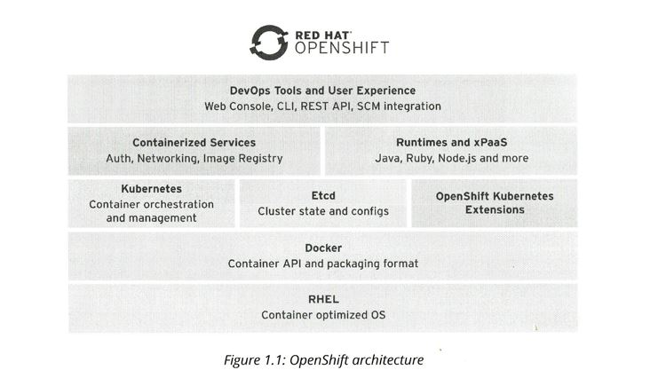
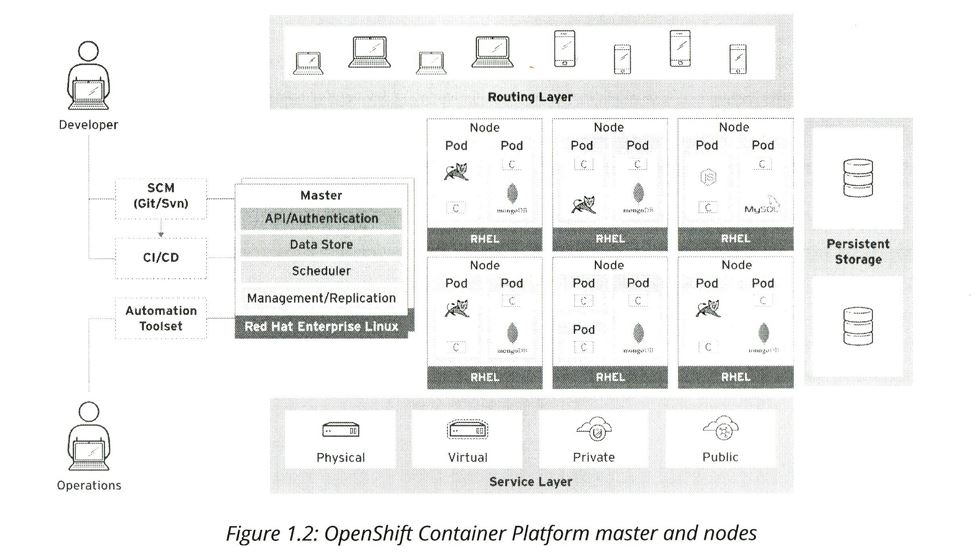

Difference between VMs and Containers, between Hypervisors and Container Managers

External links

https://en.wikipedia.org/wiki/Docker_(software) wikipedia
https://www.docker.com/  docker main site
https://hub.docker.com/ Docker Hub

https://hub.docker.com/search/?isAutomated=0&isOfficial=0&page=1&pullCount=1&q=weblogic&starCount=0  weblogic on docker hub
take this https://hub.docker.com/r/ismaleiva90/weblogic12/

•	Docker provides the basic container management API and the container image file format.
•	Kubernetes manages a cluster of hosts (physical or virtual) that run containers. It works with resources that describe multi-container applications composed of multiple resources, and how they interconnect.
•	Etcd is a distributed key-value store, used by Kubernetes to store configuration and state information about the containers and other resources inside the OpenShift cluster.

An OpenShift cluster is a set of node servers that run containers and are centrally managed by a set of master servers. A server can act as both a master and a node, but those roles are usually segregated for increased stability.

Kubernetes nodes= minions

OpenShift masters run the Kubernetes master services and Etcd daemons, while the nodes run the Kubernetes kubelet and kube-proxy daemons. While not shown in the figure, the masters are also nodes themselves. Scheduler and Management/Replication in the figure are Kubernetes master services, while Data Store is the Etcd daemon.

The kubelet is the primary “node agent” that runs on each node. (https://kubernetes.io/docs/reference/generated/kubelet/)

The Kubernetes scheduling unit is the pod, which is a grouping of containers sharing a virtual network device, internal IP address, TCP/UDP ports, and persistent storage. A pod can be anything from a complete enterprise application, including each of its layers as a distinct container, to a single microservice inside a single container. For example, a pod with one container running PHP under Apache and another container running MySQL.

Kubernetes manages replicas to scale pods. A replica is a set of pods sharing the same definition. For example, a replica consisting of many Apache and PHP pods running the same container image could be used for horizontally scaling a web application.

oc new-app bla: there is no "application" object in OS, it's only related resources, sharing the same label app=bla

SDN software defined network

Storage: glouster

PersistentVolume
PersistentVolumeClaim

https://docs.openshift.org/latest/dev_guide/persistent_volumes.html
PersistentVolume objects from sources such as GCE Persistent Disk, AWS Elastic Block Store (EBS), and NFS mounts.

oc get pvc
oc get pv

OCP Volume Providers

dig
systemctl status firewalld
systemctl status NetworkManager
iptables -F
ssh-keygen -f /root/.ssh/id_rsa -N ''
ssh-copy-id root@master

https://www.howtogeek.com/177621/the-beginners-guide-to-iptables-the-linux-firewall/

change registry
oc set image --source.docker dc/registry-console \ registry-console=workstation.lab.example.com:5000\ /openshift3/registry-console:3.5

oc get pods
NAME                            READY     STATUS      RESTARTS   AGE
docker-registry-1-qf0tz         1/1       Running     0          1m
persistent-volume-setup-p5dng   0/1       Completed   0          1m
router-1-fbwzn                  1/1       Running     0          1m

oc new-project mlbparks
oc create -f https://raw.githubusercontent.com/gshipley/openshift3mlbparks/master/mlbparks-template-wildfly.json
oc new-app mlbparks-wildfly

oc get -o wide pods --all-namespaces

#delete all internal images
oc delete is -n openshift --all

oc delete project bla

1 pod = 1 unique IP (can change with time!)
service = LB for 1 or more pods. Has also unique STABLE IP

oc scale --replicas=2 dc mlbparks

oc get pods -o wide
NAME                       READY     STATUS      RESTARTS   AGE       IP           NODE
mlbparks-1-bb29n           1/1       Running     0          4m        172.17.0.2   localhost
mlbparks-1-build           0/1       Completed   0          18h       172.17.0.2   localhost
mlbparks-1-q94r3           1/1       Running     0          18h       172.17.0.6   localhost
mlbparks-mongodb-1-vdxrs   1/1       Running     0          18h       172.17.0.5   localhost

